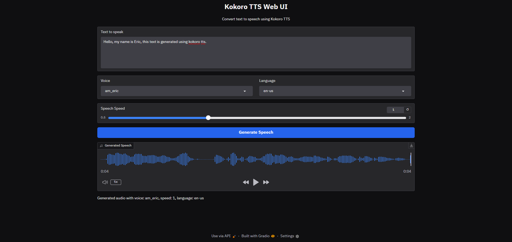

# Kokoro TTS Web UI

A simple web user interface for Kokoro Text-to-Speech using Gradio.



## Installation

1. Clone this repository

```bash
git clone https://github.com/vpakarinen/kokoro-tts-webui.git

cd kokoro-tts-webui
```

2. Create and activate virtual environment:

```bash
python -m venv kokoro-env

# Windows
.\kokoro-env\Scripts\activate

# Linux/macOS
source kokoro-env/bin/activate
```

3. Install the required packages:

```bash
pip install -r requirements.txt
```

4. Run the application:

```bash
python app.py
```

## Troubleshooting

### Encoding Issues

If you encounter a `UnicodeDecodeError`, it's likely due to encoding issues with the kokoro-onnx library. 

The app.py file already includes a fix for this issue, but if you still encounter problems, you can run it with the UTF-8 flag:

```bash
python -X utf8 app.py
```

## Required Files

The application will automatically download the following files if they don't exist:
- kokoro-v1.0.onnx (model file)
- voices-v1.0.bin (voices data)

## Credits

This project uses the [kokoro-onnx](https://github.com/thewh1teagle/kokoro-onnx) library for text-to-speech functionality.

## Author

vpakarinen (https://github.com/vpakarinen)
